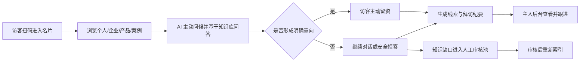

# 01 需求基线与版本范围

版本：V1.0  
基线日期：2026-07-10  
状态：可进入 Sprint 0；P0 商务/合规事项仍需确认

## 1. 产品定义

创非凡数智名片不是“带聊天框的电子名片”，而是以个人名片为入口、以企业知识为回答边界、以访客意图和线索为结果的 AI 商务接待平台。

首期核心价值闭环为：

依据：需求说明将闭环概括为“名片 → AI 接待 → 数据沉淀 → 知识库升级”〔需求说明 P0032-P0033〕；技术评审进一步把它定义为企业级 AI 商务接待平台〔评审稿 P0007-P0010、P0239-P0248〕。

## 2. 用户与职责

| 角色 | MVP 权限 | 后续扩展 |
|---|---|---|
| 平台管理员 | 创建企业、开通企业管理员、查看平台运行状态；默认不读取企业私密对话正文 | 租户、套餐、计费、系统配置 |
| 企业管理员 | 管理本企业资料、产品、案例、FAQ、禁答范围、名片和知识审核；查看本企业线索 | 组织架构、员工批量开通、细粒度授权 |
| 名片主人 | 管理本人公开名片字段；查看由本人名片产生的访客、对话、线索、纪要 | 跟进协作、CRM 同步 |
| 访客 | 匿名浏览、在提示后与 AI 对话、明确同意后主动留资 | 微信身份授权、跨次访问识别 |
| 商会管理员 | MVP 不开放 | 仅查看会员企业开通进度和聚合运营数据，不读取企业私密对话 |
| AI 审核员 | 可由企业管理员兼任 | 独立审核角色和双人复核 |

权限不直接挂在 `users.role` 上，而挂在用户与组织的成员关系上，避免同一用户兼任多个企业角色时失控。

## 3. 版本边界

### 3.1 V0.1 Demo：证明闭环可演示

建议投入：3-7 个工作日；以 1 家样板企业、1-3 张名片为范围，不作为生产验收承诺。

必须包含：

- 响应式 H5 名片页：个人、企业、至少 3 个产品/服务、至少 3 个案例。
- 结构化 FAQ/产品/案例入库与向量索引。
- 基于样板资料的多轮问答、明确 AI 身份、无依据拒答。
- 对话落库与拜访纪要生成。
- 简易企业资料和对话查看后台。

### 3.2 V1.0 MVP：支持真实小规模试用

建议投入：在 Demo 后 2-4 周，具体日期按团队人数重新基线。

P0 范围：

| 能力域 | P0 功能 |
|---|---|
| 名片与内容 | 企业资料、个人名片、产品、案例、FAQ、二维码/分享链接、公开/下架状态 |
| AI 接待 | 主动问候、多轮对话、企业级 RAG、禁答规则、拒答、意图识别、后台来源追踪 |
| 访客与线索 | 匿名会话、访问记录、主动留资、线索状态、主人备注 |
| 纪要 | 对话摘要、兴趣点、需求强度、建议动作、风险提示 |
| 知识运营 | 索引状态、知识缺口、AI 草稿、人工审核、重新索引 |
| 后台 | 企业资料、内容、名片、对话、线索、纪要、知识审核 |
| 平台能力 | 多企业数据隔离、基础 RBAC、审计、速率限制、隐私/AI 提示、可观测性 |

MVP 明确不包含：实时视频数字人、知识图谱、完整 CRM、自动报价/合同、访客内容自动入库、钉钉/企微深度集成、多端同时交付。该边界来自详细开发文档〔详细稿 T001、P0020-P0029〕。

### 3.3 V1.5 试点版：验证渠道与运营

进入条件：MVP 的 AI 质量、安全隔离和数据闭环通过验收，并有真实试点名单和运营负责人。

新增：批量开通企业与员工名片、企业资料提交进度、商会聚合看板、数据导出、回答来源展示、标准评测集和试点报告。

原始材料同时出现“50 人试点”〔需求说明 T006-R03〕与“50 家企业试点”〔评审稿 P0174-P0186；详细稿 P0047-P0058〕。本基线不把两者混为一个承诺：

- 架构和容量按 50 家企业设计；
- 商务招募与验收样本量必须由甲方书面确认；
- 未确认前，排期不得以“50 家已落实”为前提。

### 3.4 V2.0 商业化版

在试点数据证明价值后再启动：套餐与计费、组织架构、企业员工批量名片、知识版本管理、Hybrid Search + Rerank、外部消息、CRM 接口、细粒度审计、轻量语音数字人。

### 3.5 路线图能力

知识图谱、供需匹配、视频数字人、多模态资料理解和自动销售建议属于路线图，不进入当前架构的关键路径，但通过 Provider/事件接口保留扩展点。

## 4. 关键业务规则

1. 每张公开名片必须有不可枚举的 `slug`，并可单独启用、停用。
2. 公开页面只返回 `published/public` 内容；内部知识不得因 RAG 引用而暴露。
3. 匿名浏览、AI 对话、主动留资是三个不同的授权层级；留资必须显式同意。
4. AI 每次检索必须带 `company_id`，必要时再带 `card_id`、可见范围和知识版本。
5. 有依据的回答必须保存引用；资料不足、敏感、越权或要求承诺时必须拒答/转人工。
6. 访客原话和 AI 生成草稿都不能自动写入企业知识库。
7. 对话纪要是 AI 生成的辅助信息，必须标识其 AI 属性，不替代人工判断。
8. 线索状态由企业人员维护，AI 只能建议优先级，不能自动认定成交。
9. 内容下架后立即停止公开展示和新检索；历史对话只保存当时的引用快照/标识，不重新解释。
10. 删除、导出、知识审核、查看敏感访客信息必须进入审计日志。

## 5. 非功能基线

| 维度 | MVP 目标 | 验证方式 |
|---|---|---|
| 名片首屏 | 生产环境常用 4G 条件下 P75 ≤ 2.5 秒 | Web 性能测试，记录环境 |
| AI 响应 | P95 首 token ≤ 5 秒，完整回答 P95 ≤ 10 秒 | 端到端压测；模型异常单独统计 |
| 管理列表 | P95 ≤ 1 秒（常用分页查询） | API 压测 |
| 数据隔离 | 跨企业访问与检索阻断率 100% | 自动化安全用例 |
| 可用性 | 试点期月度目标 99.5%，不含已公告第三方模型故障 | 监控和事故记录 |
| 可追溯 | 100% AI 回答绑定会话、模型调用、Prompt 版本；有依据回答绑定引用 | 数据一致性检查 |
| RAG 质量 | 标准问题有资料回答通过率 ≥ 80%，无资料拒答率 ≥ 90% | 每企业不少于 20 题的离线评测 |
| 恢复 | MVP RPO ≤ 24 小时、RTO ≤ 4 小时 | 备份恢复演练 |

指标口径必须固定测试数据、模型版本和网络环境，不能用演示时的主观感受代替验收。

## 6. 需求优先级裁决规则

发生冲突时采用以下顺序：

1. 法律法规、安全隔离与已签署合同；
2. 本开发基线中已记录的决策；
3. 2026-07-10《详细开发文档》的工程边界；
4. 2026-07-08《技术方案评审稿》的风险收敛结论；
5. 2026-07-06《开发需求说明书》的业务意图。

任何新增 P0 都必须同时写明：移除或后移的等量范围、负责人、验收标准和排期影响。

## 7. 源材料证据说明

- 《创非凡数智名片_开发需求说明书_20260706.docx》：业务目标、原始 P0/P1/P2、商业版本和初始里程碑。
- 《创非凡数智名片_技术方案评审稿.docx》：平台定义、可控 RAG、人工审核、多租户、安全与分期结论。
- 《创非凡数智名片_详细开发文档.docx》：页面、表、接口、Sprint 和验收草案。

| 源文件 | 文档日期 | SHA-256 |
|---|---|---|
| 创非凡数智名片_开发需求说明书_20260706.docx | 2026-07-06 | `3C74ECDFDD742E7AFA08CD9139C4EEBB006075FEB65083EE7C7478C5DA5FE757` |
| 创非凡数智名片_技术方案评审稿.docx | 2026-07-08 | `2BDEB64119623D32D20A166D2022364AF34F0EC77239EF7F77F5518A3E5133BC` |
| 创非凡数智名片_详细开发文档.docx | 2026-07-10 | `FEDE796D4AB352A609523DCE7651BDCE800180F31863D64C4EDD26EB561C044F` |

证据编号对应 `docs/_source_extracted/` 中的本地提取稿；该目录可能含源文档个人信息，已默认加入 `.gitignore`，不应提交公共仓库。
