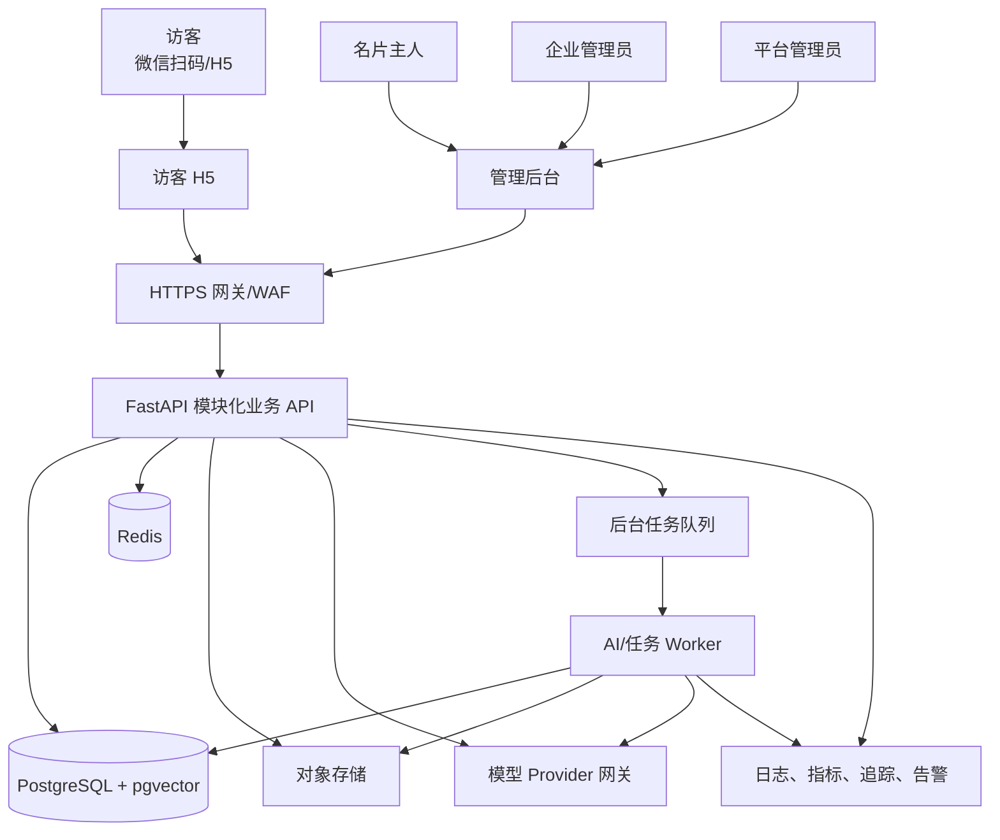
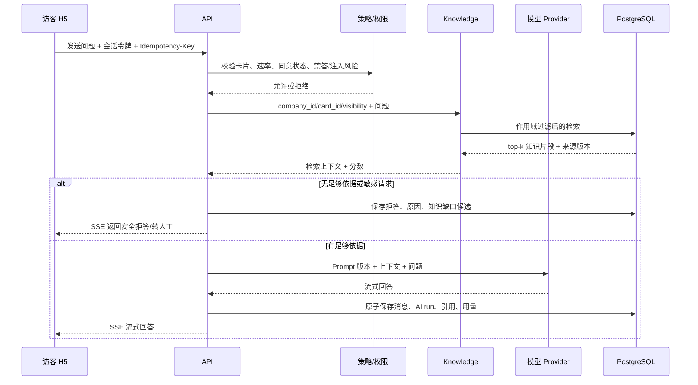
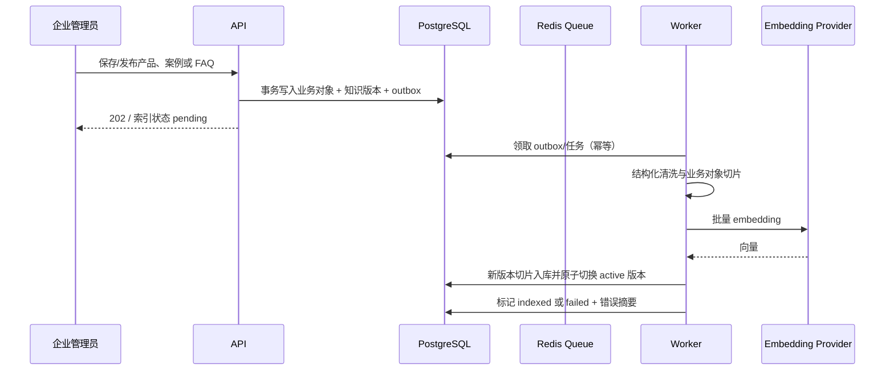

# 02 系统架构设计

版本：V1.0  
架构风格：模块化单体 + 独立异步 Worker + Provider 适配层

## 1. 架构结论

首期不采用微服务。业务 API 保持一个可独立部署的模块化单体，AI 索引、纪要、通知和离线评测放到独立 Worker；二者共享领域模型但通过队列传递耗时任务。这样既能快速交付，也保留按真实瓶颈拆分的边界。

选择 Python/FastAPI 作为后端主栈，是因为核心难点在文档处理、RAG 和评测；前端统一 TypeScript。前后端通过 OpenAPI 契约而不是共享运行时代码耦合。

## 2. 系统上下文



系统不把第三方大模型当作事实源。业务事实在 PostgreSQL，原始文件在对象存储，企业知识的可检索版本在 `knowledge_*` 表和 pgvector 中。

## 3. 组件职责

| 组件 | 职责 | 不负责 |
|---|---|---|
| `card-web` | 公开名片、产品/案例、AI 对话、留资、隐私/AI 标识 | 企业管理和敏感数据展示 |
| `admin-web` | 企业内容、名片、对话、线索、纪要、知识审核、平台运维 | 直接访问数据库或模型 |
| `api` | 鉴权、权限、事务、查询、公开接口、对话编排、审计、任务投递 | 长时间文档解析、批量 embedding |
| `worker` | 索引、重建、纪要、知识缺口草稿、通知、离线评测、清理任务 | 对外 HTTP 业务接口 |
| PostgreSQL | 业务事实、事务、审计、向量与全文索引 | 原始大文件 |
| Redis | 限流、短期会话缓存、分布式锁、可靠任务队列 | 永久事实数据 |
| 对象存储 | 头像、产品图、原始知识文件、导出文件 | 权限决策；下载必须经签名 URL/鉴权 |
| 模型 Provider 网关 | 统一 Chat/Embedding 接口、超时、重试、配额和模型路由 | 保存企业业务事实 |

## 4. 后端模块边界

```text
identity       用户、登录、Token、成员关系、RBAC
tenancy        租户、企业、企业状态、作用域上下文
cards          名片、公开字段、slug、二维码、启停
catalog        企业资料、产品、案例、FAQ、禁答规则
knowledge      文档版本、切片、索引任务、知识缺口、审核
conversation   访客会话、消息、引用、AI 调用、纪要
visitor        匿名访问、同意记录、行为事件、PII 资料
lead           留资、线索状态、跟进记录、负责人
analytics      聚合指标和看板读模型
notification   站内通知；外部渠道为 Provider 扩展
audit          管理操作、敏感读取、导出、删除日志
platform       健康检查、配置、Prompt/模型版本、运维任务
```

依赖规则：

- 路由层只调用 application/service，不直接写 ORM。
- 模块之间通过公开 service 接口或领域事件协作，不跨模块随意操作表。
- `knowledge` 不直接决定回复措辞；它只返回带来源和权限信息的检索结果。
- `conversation` 负责可控对话工作流，并调用模型/检索 Provider。
- `analytics` 消费事实事件构建聚合，不反向修改交易数据。
- 第三方 SDK 只能存在于 `infrastructure/providers`，领域层不得依赖供应商对象。

## 5. 关键时序

### 5.1 访客问答



公开端绝不能提交 `company_id` 决定检索范围；服务端必须由已验证的 `card_slug → card → company` 推导。

### 5.2 知识发布与索引



“先删除旧向量再重建”会制造检索空窗，禁止采用。新版本完整成功后再切换；失败时旧版本继续服务。

## 6. 技术栈基线

| 层 | 基线 | 说明 |
|---|---|---|
| 前端运行时 | Node.js 24 LTS | 官方建议生产使用 LTS；24 在当前日期为 LTS |
| 前端 | React + TypeScript + Vite | 两个独立应用，共享契约和 UI 基础包 |
| API | Python 3.13 + FastAPI + Pydantic 2 | Python 3.13 仍处于 bugfix 支持期；比刚发布的大版本有更宽的 AI 包兼容面 |
| ORM/迁移 | SQLAlchemy 2 + Alembic | async API、显式事务、迁移即代码 |
| Worker | Celery + Redis | 索引、摘要、通知和评测任务；至少一次投递，任务必须幂等 |
| 数据库 | PostgreSQL 18 | 当前受支持版本；生产固定最新小版本 |
| 向量 | pgvector 0.8.x | MVP 与业务数据同库，降低运维复杂度 |
| 文件 | MinIO（本地）/ OSS 或 COS（生产） | Provider 接口统一 |
| API 契约 | OpenAPI 3.1 | 生成前端客户端和契约测试 |
| 可观测 | OpenTelemetry + 结构化 JSON 日志 + Sentry/云告警 | trace_id 贯通请求、任务和模型调用 |

版本依据：Node 官方将 v24 标为 LTS，并建议生产只使用 Active/Maintenance LTS；Python 官方显示 3.13/3.14 均处于 bugfix 支持；PostgreSQL 18 支持至 2030，pgvector 0.8.2 提供 PostgreSQL 18 镜像。参见 [Node.js Releases](https://nodejs.org/en/about/previous-releases)、[Python Versions](https://devguide.python.org/versions/)、[PostgreSQL Versioning](https://www.postgresql.org/support/versioning/) 与 [pgvector](https://github.com/pgvector/pgvector)。

依赖版本以锁文件为准。大版本升级必须经过兼容性测试；不得在生产镜像使用 `latest` 标签。

## 7. 仓库和部署单元

```text
apps/card-web          独立静态产物，可上 CDN
apps/admin-web         独立静态产物，登录后使用
services/api           一个镜像，可横向扩容
services/worker        同一 Python 代码基线，不同启动命令
db/migrations          唯一数据库迁移来源
packages/contracts     OpenAPI、JSON Schema、事件定义
infra                  Compose、反向代理、部署清单
```

本地和 Demo 使用 Docker Compose：网关、两个静态前端、API、Worker、PostgreSQL/pgvector、Redis、MinIO。试点生产优先使用托管 PostgreSQL、托管 Redis 和云对象存储；API/Worker 容器化部署。

## 8. 扩展触发条件

仅在观测数据证明需要时拆分：

| 触发条件 | 候选拆分 |
|---|---|
| 索引/评测任务影响在线请求或需独立扩容 | `knowledge-worker` 服务 |
| 对话 QPS 与普通后台 API 资源模型明显不同 | `ai-orchestrator` 服务 |
| 行为事件写入量影响交易库 | 事件采集/分析存储 |
| 向量规模或召回延迟超出 pgvector 目标 | Qdrant/独立向量服务 |
| 外部通知渠道增加且重试复杂 | 通知服务 |

不得因为“以后可能很大”提前拆微服务；每次拆分需有容量数据、故障边界和团队所有权依据。

## 9. 故障与降级

- 大模型不可用：名片展示、产品/案例和留资继续可用；对话提示稍后重试或联系主人。
- Embedding/索引失败：保留上一可用知识版本，后台显示失败原因并允许重试。
- Redis 不可用：不接受新后台任务；在线查询走数据库，严格限流，不使用内存队列冒充可靠队列。
- 对象存储不可用：已缓存图片可继续；新上传失败并可重试，不写入“成功”状态。
- 通知渠道失败：线索仍落库；站内展示为事实源，外部通知异步重试。
- 模型输出解析失败：保存原始 run（脱敏），返回安全兜底，不生成结构不完整的线索/纪要。

