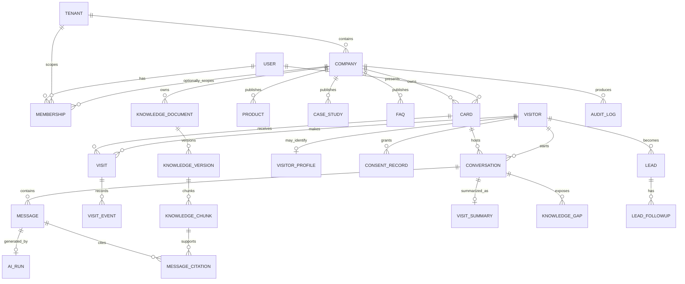

# 03 数据模型、租户隔离与权限

版本：V1.0  
原则：业务事实可追溯、企业默认互不可见、PII 与匿名行为分域

## 1. 作用域模型

MVP 使用三级主作用域：

```text
tenant（合同、计费和安全边界）
└── company（企业知识和业务边界）
    └── card（公开入口和名片主人数据范围）
```

- 商会试点可建一个 `tenant(type=chamber)`，会员企业作为该租户下的多个 `company`。
- 直接采购企业可建一个 `tenant(type=enterprise)`，通常只有一个 `company`。
- 商会管理员默认只能看开通进度和聚合指标，不得读取企业知识原文、访客 PII 或对话正文。
- 同一自然人可以通过 `memberships` 在多个租户/企业拥有不同角色；角色不得直接固化在 `users` 上。
- 跨商会的同一企业如何去重属于商业化阶段数据治理问题，MVP 不做跨租户自动合并。

## 2. 领域关系



## 3. MVP 表清单

### 3.1 身份与租户

| 表 | 关键字段 | 约束 |
|---|---|---|
| `tenants` | `id`, `name`, `type`, `status`, `settings` | 租户只可停用，不物理复用 ID |
| `companies` | `id`, `tenant_id`, `name`, `industry`, `status` | `tenant_id + normalized_name` 建唯一/查重策略 |
| `users` | `id`, `mobile/email`, `display_name`, `status` | 只表示身份，不存业务角色 |
| `memberships` | `user_id`, `tenant_id`, `company_id?`, `role`, `status` | 角色作用于成员关系；组合唯一 |
| `auth_sessions` | `user_id`, `refresh_token_hash`, `expires_at`, `revoked_at` | 只存 Token 哈希，支持逐会话撤销 |

首期角色：`platform_admin`、`company_admin`、`card_owner`。`knowledge_reviewer` 可作为企业成员的附加权限，不新增不受控的全局角色。

### 3.2 名片与企业内容

| 表 | 关键字段 | 说明 |
|---|---|---|
| `cards` | `tenant_id`, `company_id`, `owner_user_id`, `slug`, `status`, `published_at` | `slug` 使用高熵随机值并全局唯一 |
| `card_contact_fields` | `card_id`, `field_type`, `value_ciphertext`, `visibility` | 电话/微信/邮箱逐字段控制公开性 |
| `products` | `company_id`, `name`, `summary`, `detail`, `visibility`, `status`, `version` | 公开与可检索范围分别校验 |
| `case_studies` | `company_id`, `title`, `industry`, `solution`, `result`, `visibility`, `status` | 客户名称默认不公开 |
| `faqs` | `company_id`, `question`, `answer`, `tags`, `visibility`, `status`, `version` | 发布后进入知识索引 |
| `forbidden_topics` | `company_id`, `pattern/topic`, `action`, `status` | `refuse`、`handoff`、`safe_template` |

业务内容采用状态机 `draft → review_pending → published → archived`。直接删除已发布内容只产生新版本/归档；物理清理由保留策略任务执行。

### 3.3 知识与索引

| 表 | 关键字段 | 说明 |
|---|---|---|
| `knowledge_documents` | `company_id`, `source_type`, `source_id`, `title`, `current_version_id` | 稳定逻辑对象 |
| `knowledge_versions` | `document_id`, `version`, `raw_text`, `content_hash`, `review_status`, `published_at` | 内容不可变版本 |
| `knowledge_chunks` | `version_id`, `company_id`, `text`, `embedding`, `embedding_model`, `visibility`, `metadata` | 索引单元；公司作用域冗余便于安全过滤 |
| `knowledge_index_jobs` | `company_id`, `version_id`, `status`, `attempt`, `error_code`, `started_at` | 幂等键为 `version_id + embedding_model` |
| `knowledge_gaps` | `company_id`, `conversation_id`, `question`, `reason`, `status`, `suggested_answer` | 访客原话不得直接发布 |

统一知识缺口状态：

```text
pending → drafted → approved → indexing → indexed
          └────────→ rejected
approved/indexing ─→ failed → approved（人工重试）
```

详细稿中 `pending/suggested/approved/rejected/indexed` 与表字段不一致，本基线统一使用上面的枚举。

### 3.4 访客、对话与线索

| 表 | 关键字段 | 说明 |
|---|---|---|
| `visitors` | `company_id`, `anonymous_hash`, `first_seen_at`, `last_seen_at` | 企业内假名化标识；不建立平台级跨企业画像 |
| `visitor_profiles` | `visitor_id`, 加密的姓名/电话/微信, `company_name` | 与行为表分离，只有授权角色可读取 |
| `consent_records` | `visitor_id`, `scope`, `policy_version`, `granted_at`, `evidence` | `browse_notice`、`chat_notice`、`lead_contact` 分开记录 |
| `visits` | `company_id`, `card_id`, `visitor_id`, `source`, `started_at`, `ended_at` | 支撑 PV/UV、来源和会话关联 |
| `visit_events` | `visit_id`, `event_type`, `object_type/id`, `occurred_at`, `metadata` | 白名单事件；不收集无业务必要的设备指纹 |
| `conversations` | `company_id`, `card_id`, `visitor_id`, `status`, `primary_intent`, `closed_at` | `active → closed/expired/blocked` |
| `messages` | `conversation_id`, `role`, `content`, `status`, `created_at` | 内容需按策略脱敏后进入日志/导出 |
| `ai_runs` | `message_id`, `provider`, `model`, `prompt_version`, token/latency/cost, `safety_result` | 支撑复现、成本和故障分析 |
| `message_citations` | `message_id`, `chunk_id`, `rank`, `score`, `snapshot_text/hash` | 不用 `uuid[]` 代替关系与证据 |
| `visit_summaries` | `conversation_id`, `summary`, `interests`, `strength`, `next_step`, `risk_notes` | 对话关闭/超时后幂等生成 |
| `leads` | `company_id`, `card_id`, `visitor_id`, `owner_user_id`, `status`, `priority`, `demand` | 联系方式引用加密 profile，不复制明文 |
| `lead_followups` | `lead_id`, `actor_user_id`, `type`, `content`, `next_at` | 跟进历史只追加，修改留痕 |

`visits` 是原详细稿缺失但 PV/UV 和访问接口必需的表；`message_citations`、`ai_runs` 用于满足来源与模型调用追溯要求。

### 3.5 治理与可靠性

| 表 | 用途 |
|---|---|
| `audit_logs` | 登录、敏感查看、导出、内容/权限修改、知识审核、删除；追加写 |
| `outbox_events` | 业务事务与异步任务的可靠交接 |
| `notifications` | 站内通知事实源和外部通知状态 |
| `prompt_versions` | Prompt 内容、用途、版本、发布人、评测结果 |
| `model_configs` | 企业/环境可用模型配置，只保存密钥引用而非密钥明文 |

## 4. 通用字段与数据库约束

- 主键使用 UUIDv7 或数据库生成 UUID；公开 ID 与数据库自增序号分离。
- 核心业务表必须有 `tenant_id`、`company_id` 中适用的字段，即使能通过外键推导也保留安全作用域。
- 时间统一 `timestamptz`、数据库存 UTC、界面按用户时区显示。
- 可编辑资源使用 `version` 乐观锁；更新请求不匹配返回 `409 VERSION_CONFLICT`。
- 所有状态使用数据库约束或 PostgreSQL enum/检查约束，不能接受任意字符串。
- `created_at/updated_at` 由数据库或统一 ORM mixin 管理；审计表不可覆盖更新。
- 软删除资源必须带 `deleted_at/deleted_by`，默认查询自动排除。
- 模型生成结构化结果使用 JSON Schema 校验；无效结果不写入正式业务字段。

## 5. 租户隔离实施

采用四层防线：

1. 入口：由认证会话或 `card_slug` 推导作用域，拒绝客户端自行指定企业。
2. 应用：请求上下文固定 `tenant_id/company_id/member_id`，Repository 必须接收作用域。
3. 数据库：对企业核心表启用 PostgreSQL Row-Level Security；每个事务设置受信任的 `app.tenant_id`/`app.company_id`。
4. 测试与审计：每个查询/检索路径有 A/B 企业越权测试，异常拒绝写审计和安全告警。

平台管理员不默认绕过 RLS。需要排障时使用有时限、写明工单理由、全量审计的 `break-glass` 支持会话。

向量检索必须在 SQL 中先应用 `company_id + active_version + visibility` 条件，再计算相似度；禁止检索全库后在应用层过滤。

## 6. PII、加密和日志

- 电话、微信号、邮箱、姓名等留资字段使用应用层信封加密；密钥来自 KMS/密钥管理服务。
- 搜索手机号时保存独立 HMAC 索引，不使用可逆明文索引。
- API 响应按权限掩码展示；列表默认显示脱敏值，详情读取产生审计。
- 日志禁止记录访问/刷新 Token、完整手机号、微信号、模型 API 密钥和完整 Prompt 上下文。
- 发送给第三方模型前执行 PII 最小化；企业资料是否允许出境/用于供应商改进必须由合同和法务确认。
- 企业知识默认设置为“不用于模型训练”，Provider 合同与控制台配置必须与此一致。

## 7. 留存与删除

以下是技术建议初值，不是法律意见，必须由业务负责人和法务在上线前确认：

| 数据 | 建议初值 | 删除/匿名化要求 |
|---|---|---|
| 匿名访问事件 | 90 天明细，之后只留聚合 | 删除可关联标识 |
| 对话正文/AI run | 180 天 | 到期删除正文；必要审计只留哈希和统计 |
| 访客留资 | 目的达成、撤回或最长 180 天未跟进 | 删除 profile 并断开线索引用 |
| 导出文件 | 24 小时下载有效，7 天物理清理 | 对象存储生命周期策略 |
| 审计日志 | 建议 2 年 | 加密、最小权限、防篡改；期限法务确认 |
| 备份 | 建议 30 天滚动 | 删除请求进入备份到期清理说明 |

必须实现：查询/复制、更正、撤回同意、删除申请的受理流程；删除要覆盖业务表、向量、缓存、导出和对象存储，并记录完成证据。

个人信息处理、生成式 AI 服务和网络数据安全涉及正式合规义务。上线前需以法务意见为准，参考官方的[个人信息保护法](https://www.miit.gov.cn/jgsj/zfs/fl/art/2022/art_515a4b20c12f430eab54bb4f56d89f56.html)、[生成式人工智能服务管理暂行办法](https://www.cac.gov.cn/2023-07/13/c_1690898327029107.htm)、[人工智能生成合成内容标识办法](https://www.cac.gov.cn/2025-03/14/c_1743654684782215.htm)和[网络数据安全管理条例](https://app.www.gov.cn/govdata/gov/202409/30/520076/article.html)。

## 8. 必备索引与分区建议

- `cards(slug)` 唯一索引；状态字段参与部分索引。
- 各业务表 `(company_id, status, updated_at desc)`。
- `memberships(user_id, tenant_id, company_id, status)`。
- `visits(card_id, started_at desc)`、`conversations(card_id, started_at desc)`。
- `messages(conversation_id, created_at)`。
- `leads(company_id, owner_user_id, status, created_at desc)`。
- `knowledge_chunks(company_id, visibility, version_id)` 加向量 HNSW/IVFFlat；索引参数用评测决定。
- `visit_events`、`audit_logs` 数据量达到单表运维阈值后按月分区，不在 Demo 阶段提前复杂化。

