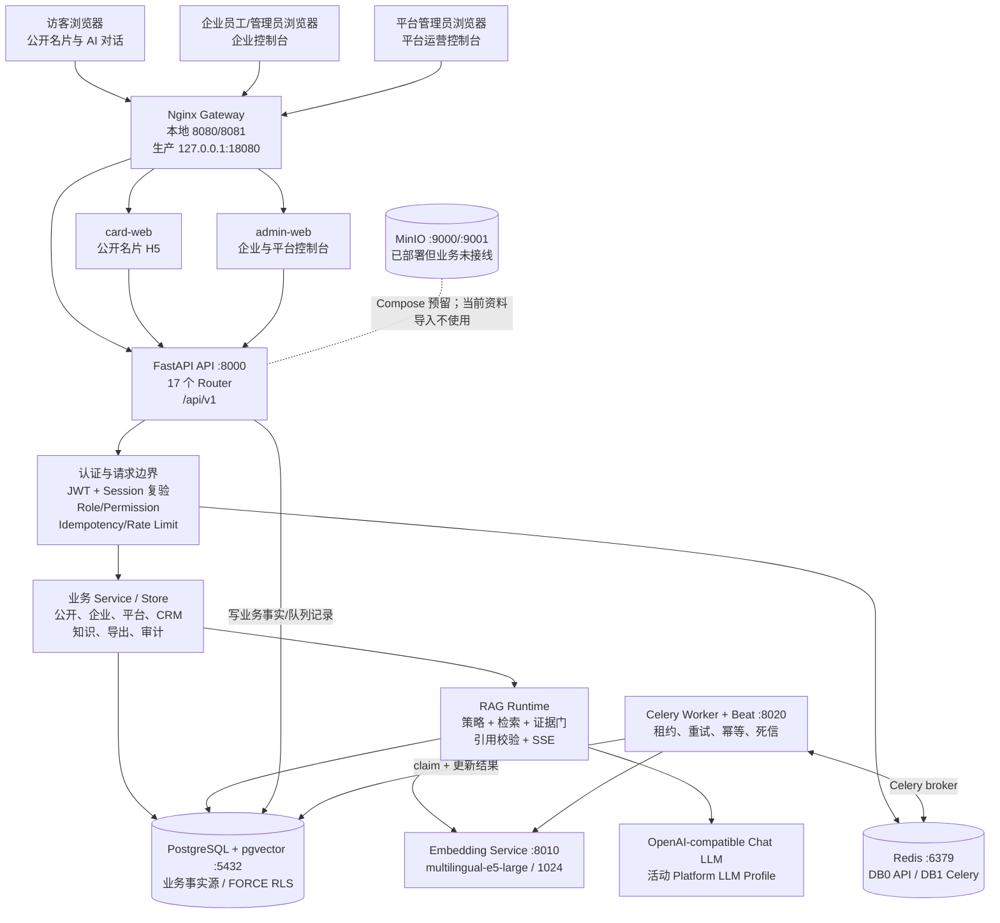
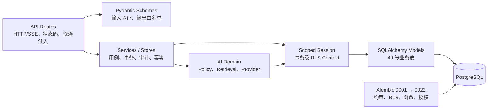
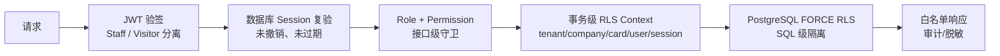
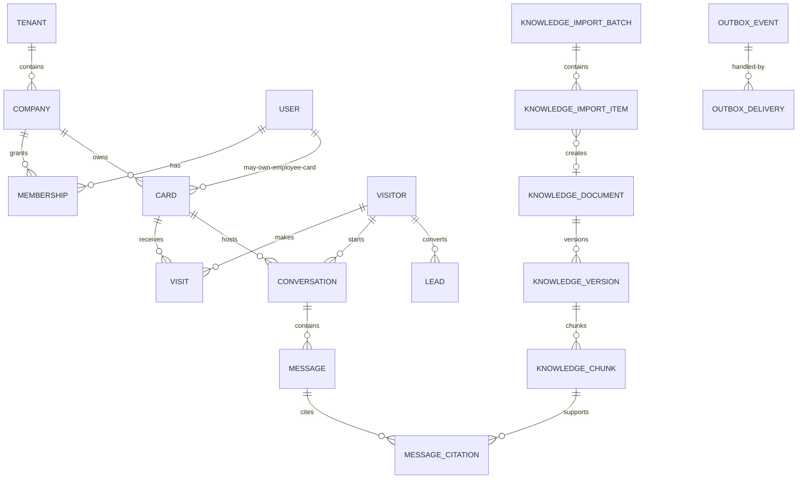
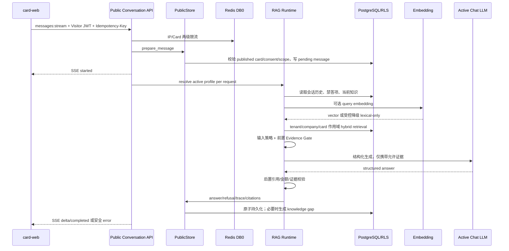
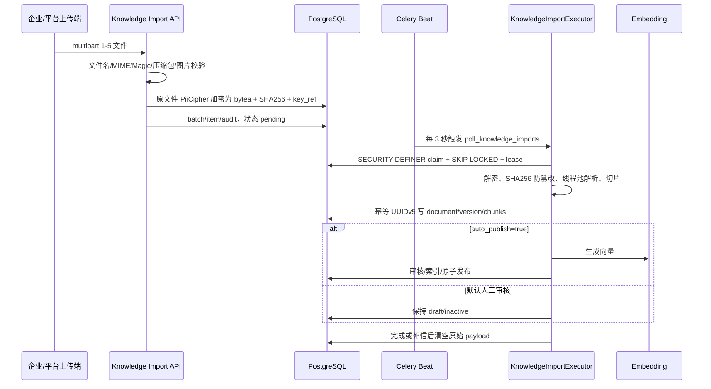
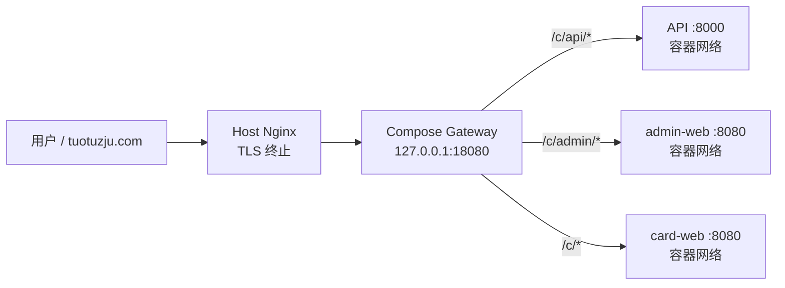

# 20 后端全景与全局图

版本：V1.0（2026-07-17）  
源码基线：`main@25cd184`  
状态：当前源码事实汇总；运行实例状态另行验证  
适用读者：产品、前端、后端、AI、测试、运维、安全

## 1. 文档目的

这是一份后端“一站式入口”文档。它不替代 OpenAPI、迁移和各专项运行手册，而是回答以下问题：

- 后端由哪些服务组成，各自负责什么；
- 浏览器请求怎样进入 API、数据库、AI 和异步任务；
- 平台、企业管理员、员工和访客之间怎样隔离；
- 数据、资料导入、知识发布、RAG 问答和 Worker 怎样流转；
- 本地、Compose、生产环境分别使用哪些端口和路径；
- 哪些能力已经接线，哪些只是基础设施或仍未完成验收；
- 出现问题时应该先查哪个入口、运行哪条验证命令。

事实优先级如下：

1. 当前源码、Alembic 迁移、Compose/Nginx 配置；
2. `packages/contracts/openapi.json`；
3. 当前 OpenSpec change 及其执行计划；
4. 本目录既有设计和运行手册。

注意：本文确认的是源码基线。除非明确写有“本轮运行验证”，否则不能据此推断某台运行中的数据库已经迁移到最新版本，或某个外部模型、Worker、MinIO 当前可用。

## 2. 一句话架构结论

这是一个多租户数智名片后端：FastAPI 提供公开名片、企业管理和平台运营三类 API；PostgreSQL 是业务事实源并用 `FORCE RLS` 做租户隔离；Redis 同时承担 API 限流和 Celery broker；Celery Worker 处理 Outbox、资料导入、定时发布、留存清理和评测；本地 Embedding 服务与外部 OpenAI-compatible Chat LLM 组成 RAG；Nginx Gateway 统一承载公开端、管理端和 API 路径。

## 3. 系统全局图



### 3.1 核心组件职责

| 组件 | 当前职责 | 关键入口 |
|---|---|---|
| `card-web` | 公开名片、访问、留资、AI 对话 | `apps/card-web/` |
| `admin-web` | 企业控制台、平台运营控制台、知识与名片管理 | `apps/admin-web/` |
| FastAPI | HTTP/SSE 契约、认证、权限、业务编排、健康与指标 | `services/api/app/main.py` |
| PostgreSQL | 所有业务事实、RLS、pgvector、Outbox、导入队列、审计 | `services/api/app/db/`、`services/api/migrations/` |
| Redis DB0 | API 限流和短期协作状态 | `services/api/app/core/rate_limit.py` |
| Redis DB1 | Celery 消息 broker；不是业务事实源 | `services/worker/cf_worker/celery_app.py` |
| Worker/Beat | Outbox、资料导入、定时发布、留存清理、评测 | `services/worker/cf_worker/` |
| Embedding | OpenAI-compatible `/v1/embeddings`，本地 CPU 向量化 | `services/embedding/app.py` |
| Chat LLM | 结构化回答生成；配置来自当前活动平台 Profile | `services/api/app/services/ai_runtime.py` |
| Gateway | `/c/`、`/c/admin/`、`/c/api/` 路由和反向代理 | `infra/gateway/nginx.conf` |
| MinIO | Compose 中已存在的对象存储基础设施 | 当前业务代码未接线 |

## 4. 后端代码分层



目录职责：

| 目录 | 职责 |
|---|---|
| `services/api/app/api/routes/` | 路由与协议层，不应承载复杂持久化逻辑 |
| `services/api/app/api/*_schemas.py` | 请求/响应模型和字段白名单 |
| `services/api/app/services/` | 业务用例、Store、事务、审计、导入和运行时配置 |
| `services/api/app/ai/` | RAG 编排、输入策略、检索、Provider 和输出 Schema |
| `services/api/app/db/models.py` | SQLAlchemy 模型与枚举 |
| `services/api/app/db/session.py` | async session 与 RLS 上下文 |
| `services/api/migrations/versions/` | 数据库结构、RLS、角色授权和数据库函数的真实演进 |
| `services/worker/cf_worker/` | Celery、Outbox、导入、定时任务和 Worker 健康 |
| `packages/contracts/openapi.json` | 前后端对账的 OpenAPI 契约快照 |

## 5. API 全景

FastAPI 默认前缀为 `/api/v1`。当前源码注册 17 个 Router，源码中约 166 条路由；已提交 OpenAPI 契约包含 165 个操作。差异主要来自运行/观测入口，发布前必须以契约检查确认，而不能只比较人工计数。

### 5.1 API 业务域

| API 面 | 主要路径 | 职责 | 主要调用者 |
|---|---|---|---|
| 健康与观测 | `/health/live`、`/health/ready`、`/metrics` | 存活、依赖就绪、指标 | Gateway、运维 |
| 员工认证 | `/auth/login`、`/refresh`、`/logout`、`/me` | 员工/平台会话 | admin-web |
| 公开名片 | `/public/cards/{slug}` | 已发布名片、产品、案例、推荐 | card-web |
| 访客互动 | `/public/cards/{slug}/visits`、`consents`、`leads` | 访问、同意、留资 | card-web |
| 公开 AI | `/public/cards/{slug}/conversations`、`/public/conversations/{id}/messages:stream` | 对话创建与 SSE 回答 | card-web |
| 企业名片 | `/admin/card`、`/admin/cards` | 单卡兼容入口、多卡、发布、停用、内容覆盖 | 企业控制台 |
| 企业内容 | `/admin/products`、`case-studies`、`faqs`、`forbidden-topics` | 产品、案例、FAQ、禁答 | 企业控制台 |
| 知识运营 | `/admin/knowledge/*` | 文档、版本、导入、切片、索引、知识缺口、评测 | 企业控制台、Worker |
| CRM/访客 | `/admin/leads`、`visits`、`conversations`、`visitor-profiles` | 线索、访问、会话、访客画像 | 企业控制台 |
| 成员治理 | `/admin/members`、`privacy-requests`、`exports` | 成员、隐私请求、导出 | 企业管理员 |
| 平台运营 | `/platform/overview`、`enterprises`、`tasks`、`audit`、`health` | 跨企业窄投影与治理 | 平台管理员 |
| 平台 LLM | `/platform/settings/llm/profiles` | Profile 新建、更新、测试、激活 | 平台管理员 |
| 平台建企 | `/platform/onboarding` | 建企会话、资料上传、建议、确认、取消 | 平台管理员 |

OpenAPI 完整字段、状态码和 Schema 不在本文复制，统一查看 `packages/contracts/openapi.json` 或启用后的 API docs。

### 5.2 统一请求约定

- 访问 Token 使用 `Authorization: Bearer ...`。
- Staff Token 解码后默认还会查询数据库，复验 session、membership、tenant、company、role 和 permissions。
- 访客 Token 与 Staff Token 完全分离，携带 card/visitor/conversation 作用域。
- 有副作用的关键接口要求 `Idempotency-Key`，长度 8–128。
- 乐观锁资源使用 `version` 或 `expected_version`；并发冲突返回 `409`。
- 所有请求拥有 `X-Request-Id`；响应透传，日志按该 ID 关联。
- 业务错误使用统一 envelope；422 只暴露安全的字段位置与类型，不回显敏感输入。
- AI 回答使用 SSE；浏览器断开不必然取消已开始的后台持久化任务。

## 6. 身份、权限与多租户隔离

### 6.1 防线模型



当前角色包括：

- `platform_admin`：平台运营；不获得普通企业会话，也不允许无边界读取企业私密正文；
- `company_admin`：企业管理员；管理本企业成员、名片、知识和客户运营；
- `card_owner`：名片持有人；只获得授权的名片/业务能力；
- visitor：公开访客身份；只能在已发布卡片与已签发 token 的范围内活动。

### 6.2 RLS 实施

每个事务通过 `set_config(..., true)` 写入：

- `app.tenant_id`
- `app.company_id`
- `app.card_slug`
- `app.user_id`
- `app.session_id`

核心业务表启用并强制 `ROW LEVEL SECURITY`。API 运行账号与 Worker 账号均为 `NOSUPERUSER`、`NOBYPASSRLS` 的独立最小权限角色。

公开 slug 不是认证凭据：数据库公开策略只允许精确 slug、已发布、未删除、已到发布时间的名片。访客对话、同意与留资还必须同时通过 visitor token、conversation/card/visitor 对齐和同意状态检查。

平台跨租户列表和聚合不通过普通 ORM 绕过 RLS，而是调用受控的 `SECURITY DEFINER` read-model 函数；这些函数 `REVOKE PUBLIC`，只给指定 runtime role 执行权限，并返回显式白名单字段。

## 7. 数据全景

当前 SQLAlchemy 模型对应约 49 张业务表，按领域可分为九组。

| 领域 | 主要实体 | 说明 |
|---|---|---|
| 租户与身份 | tenant、company、user、membership、auth_session、staff_credential | 平台/企业/成员与登录事实 |
| 名片与企业内容 | card、card_contact_field、product、case_study、distribution、override/revision | 企业官方名片与员工名片、内容继承和覆盖 |
| 访客行为 | visitor、visitor_profile、signal/source、consent、visit、visit_event | 访问、同意、画像信号 |
| 对话与 AI | conversation、message、prompt_version、model_config、platform_llm_profile、ai_run、citation | 问答、模型配置、调用和引用证据 |
| 知识 | document、version、chunk、index_job、gap | 草稿、审核、发布、切片与知识缺口 |
| 资料导入 | knowledge_import_batch、knowledge_import_item | 原文件队列、解析/发布状态、租约和重试 |
| CRM | lead、lead_followup、visit_summary | 线索、跟进、会话/访问摘要 |
| 治理 | privacy_request、notification、idempotency_key、audit_log、security_event | 隐私、通知、幂等、审计与安全事件 |
| 异步与交付 | outbox_event、outbox_delivery、worker_job_result、data_export_request、scheduled_publish_job、platform_onboarding_session | 异步任务、导出、定时发布与建企流程 |

### 7.1 概念关系图



### 7.2 迁移状态

- 源码 Alembic 为线性迁移链 `20260710_0001` → `20260717_0022`。
- `0001` 建立核心数据模型、RLS 与基础函数。
- `0007` 增加 Worker Outbox、租约和 claim 函数。
- `0012`/`0013` 增加资料导入与多格式支持。
- `0015` 修复数据库角色授权。
- `0016` 增加平台 LLM Profiles。
- `0017` 增加平台运营 read models。
- `0018`–`0022` 演进平台资料辅助建企。

这里的“迁移头 0022”只表示源码头；本轮没有连接运行数据库读取 `alembic_version`，因此运行库状态标记为 `UNVERIFIED`。

## 8. 公开 AI / RAG 调用链



关键安全点：

- Chat 配置每次请求从当前活动 `PlatformLLMProfile` 解析，无需重启；数据库零 Profile 时才允许环境变量兜底。
- 活动 Profile 被禁用或解析失败时不得静默切回另一套配置。
- Embedding 配置仍来自进程配置；Embedding 失败可按策略降级到词法检索。
- 检索在 SQL 内先约束 tenant、company、card、知识版本、审核状态和 visibility，再进行排序。
- Prompt injection、凭据、隐私、高风险承诺和无证据价格在策略层或证据门被阻断。
- 模型只能引用提供的 evidence ID；未知引用使回答拒绝发布。
- 保存模型/Prompt/知识版本、token、延迟、引用和错误分类，但不保存模型思考链。

## 9. 资料导入真实链路

当前唯一导入实现是 `knowledge_import`。它不使用参考项目的 `document_import`、Docling 或 OCR 服务。



当前限制与合同：

- 每批 1–5 个文件；单文件不超过 10 MB；批次不超过 25 MB。
- 支持 PDF、DOCX、CSV、PPTX、XLSX、TXT、Markdown、HTML 和常见图片格式；支持并不等于所有图片已具备 OCR。
- API 请求线程只做验证和加密入队，不做重解析。
- 一个文件对应一个可审计的 import item 和一个知识文档。
- `document_id`、`version_id`、chunk ID 基于 import item 生成 UUIDv5，重试不会重复创建业务结果。
- 默认 `auto_publish=false`，资料先进入草稿/审核状态。
- 原始文件当前以加密 `bytea` 暂存在 PostgreSQL；成功或 dead-letter 后清空。

### 9.1 MinIO 的真实状态

MinIO 已在 Compose 中定义，并在生产配置中注入 `OBJECT_STORAGE_*`，但当前 API/Worker 没有接入 S3/MinIO 客户端，API 也不依赖 MinIO 启动。平台健康接口对对象存储返回 `DIRECT_PROBE_NOT_CONFIGURED`。

因此，架构图必须把 MinIO 标为“基础设施已部署、业务未接线”，不能写成“上传文件进入 MinIO”。

## 10. Worker、Outbox 与异步可靠性

Worker 使用 Celery 5.6 和 Redis DB1，但任务状态、租约、重试和结果均以 PostgreSQL 为真源。

### 10.1 Beat 周期任务

| 任务 | 默认周期 | 作用 |
|---|---:|---|
| `poll_outbox` | 1 秒 | 领取并投递业务 Outbox |
| `poll_scheduled_publishes` | 5 秒 | 执行定时发布 |
| `poll_knowledge_imports` | 3 秒 | 处理资料导入 |
| `purge_expired_visitor_profiles` | 3600 秒 | 清理过期访客画像 |

### 10.2 投递语义

```text
业务事务写 outbox(pending)
  → PostgreSQL claim（FOR UPDATE SKIP LOCKED）
  → processing + lock_token + lease_expires_at
  → Redis/Celery 只传 event id、scope 和 lease token
  → Worker 在事件 tenant/company RLS 下处理
  → delivery/result + published 同事务提交
```

- 语义为至少一次投递，通过确定性 ID、唯一 delivery 和 lock token 收敛为一次业务效果。
- `acks_late=true`、worker lost reject、prefetch=1。
- Redis visibility timeout 是数据库 lease 的两倍。
- 默认导入 batch size 10、lease 900 秒、最多 6 次尝试。
- 瞬时错误指数退避；永久错误或次数耗尽进入 `dead_letter`。
- 数据库基础设施失败时多个 poller 共享 30 秒冷却，防止错误风暴。

## 11. 运行与部署全景

### 11.1 本机原生开发

| 服务 | 地址/端口 | 说明 |
|---|---|---|
| card-web | `http://127.0.0.1:4173` | 公开名片开发服务器 |
| admin-web | `http://127.0.0.1:4174` | 管理端开发服务器 |
| API | `http://127.0.0.1:8000` | `/api/v1` |
| Embedding | `http://127.0.0.1:8010` | 本地模型服务 |
| Worker health | `http://127.0.0.1:8020` | `/health/live`、`/health/ready` |
| PostgreSQL | `127.0.0.1:5432` | 本地数据库 |
| Redis | `127.0.0.1:6379` | DB0/DB1 |

`tools/local-runtime.ps1` 不启动 MinIO，所以本机原生运行与 Compose 不是完全等价环境。

### 11.2 Local Compose

| 服务 | 宿主端口 | 说明 |
|---|---:|---|
| Gateway public | 8080 | card-web + `/api/` |
| Gateway admin | 8081 | admin-web + `/api/` |
| API | 8000 | 直接调试 |
| Worker health | 8020 | Worker 健康 |
| PostgreSQL | 5432 | pgvector PostgreSQL |
| Redis | 6379 | AOF |
| MinIO API / Console | 9000 / 9001 | 目前业务未接线 |
| Embedding | 无宿主映射 | Compose 网络内 `embedding:8010` |

### 11.3 生产路径



- 生产仅将 Gateway 发布到 loopback `127.0.0.1:18080`。
- PostgreSQL、Redis、MinIO、API、Embedding 和 Worker 不发布宿主端口。
- Host Nginx 负责 TLS，保留 `/c` 前缀。
- Gateway 将 `/c/api/*` rewrite 到 API，将 `/c/admin/*` 转到管理端，其余 `/c/*` 转到公开端。
- 生产 API 使用 `ASGI_ROOT_PATH=/c`；前端 API base 为 `/c/api/v1`。

## 12. 健康、日志与可观测性

| 检查 | 当前含义 | 不代表什么 |
|---|---|---|
| API `/health/live` | API 进程存活 | 不代表依赖可用 |
| API `/health/ready` | PostgreSQL `SELECT 1` + Redis ping | 不检查 Embedding、LLM、Worker、MinIO |
| Worker `/health/live` | Worker 健康线程存活 | 不代表 DB/broker 可用 |
| Worker `/health/ready` | worker_ready + PostgreSQL 权限检查 + Redis ping | 不代表 LLM 可用 |
| Embedding `/health/ready` | 模型已加载 | 不代表 RAG 端到端通过 |
| Gateway `/gateway-health` | Nginx Gateway 存活 | 不代表所有 upstream 业务正常 |
| Platform `/platform/health` | 业务化服务探针汇总 | MinIO/Worker 当前存在固定 degraded 项 |

关键观测能力：

- `X-Request-Id` 和结构化日志；
- API MetricsMiddleware 与受 Bearer token 保护的指标；
- AI run 记录模型、Prompt、知识版本、token、延迟、错误和引用；
- 追加写审计日志、安全事件、Outbox delivery 和 Worker job result；
- 日志和错误响应执行敏感信息脱敏，不应记录 Token、连接串、密钥、完整 Prompt 或导入 payload。

## 13. 当前实现状态与边界

### 13.1 已在源码中实现

- 多租户 FastAPI、PostgreSQL FORCE RLS、独立 app/worker 数据库角色；
- 公开名片、访客、对话、留资、企业内容、CRM、成员和治理 API；
- 平台运营窄投影、企业状态治理、LLM Profiles 和资料辅助建企后端；
- 活动 LLM Profile 按请求生效，数据库零 Profile 时环境变量兜底；
- PostgreSQL 混合检索、Embedding、证据门、引用校验和 SSE；
- Celery/Redis + PostgreSQL lease 的 Outbox、资料导入和定时任务；
- Local Compose、生产 Compose、Gateway 与 host Nginx 路径合同。

### 13.2 仍需明确标记的缺口

- 当前 OpenSpec 计划仍有平台建企向导 UI、完整企业/员工 `card_kind` 收口和最终综合验收未完成项。
- `knowledge_import` 已有多格式解析，但不能把图片格式支持等同于完整 OCR 产品能力。
- MinIO 业务链路未接线；资料原文件当前存 PostgreSQL 加密 `bytea`。
- API readiness 不覆盖完整 AI/Worker/对象存储依赖。
- 源码迁移头为 0022，但运行数据库版本本轮未验证。
- 本轮 `local:status` 未在限定时间内返回，因此当前服务是否正在运行标记为 `UNVERIFIED`。
- OpenAPI 契约与源码路由存在人工统计上的 1 条差异，必须由自动化 contract check 决定是否一致。

## 14. 常用运行和验证命令

### 14.1 启停与状态

```powershell
corepack pnpm local:start
corepack pnpm local:status
corepack pnpm local:stop
```

### 14.2 API 与契约

```powershell
corepack pnpm contracts:check
corepack pnpm contracts:validate
node tools/run-python.mjs api -m pytest services/api/tests/test_openapi_implementation.py
```

### 14.3 后端单元测试

```powershell
node tools/run-python.mjs api -m pytest services/api/tests -m "not integration"
node tools/run-python.mjs worker -m pytest services/worker/tests -m "not integration"
```

### 14.4 安全与关键链路聚焦测试

```powershell
node tools/run-python.mjs api -m pytest `
  services/api/tests/test_auth_routes.py `
  services/api/tests/test_database_contract.py `
  services/api/tests/test_public_security.py `
  services/api/tests/test_ai_runtime.py `
  services/api/tests/test_ai_orchestrator.py `
  services/api/tests/test_platform_operations.py `
  services/api/tests/test_platform_llm_routes.py `
  services/api/tests/test_platform_onboarding.py
```

### 14.5 真实 RAG 评测

```powershell
corepack pnpm eval:validate
corepack pnpm eval:live:tuotu
```

`eval:live:tuotu` 需要真实数据库、当前知识、Embedding 和合法模型配置；未通过发布门槛时不得用一次手工问答替代。

## 15. 故障定位入口

| 症状 | 第一检查点 | 下一步 |
|---|---|---|
| 登录失败 | `/auth/login` 状态码与 request id | 查 session、membership、锁定/限流和 DB |
| 登录成功但后台报错 | 第一个失败的 `/admin/*` 请求 | 查 role/permission、RLS context、迁移版本 |
| 公开卡 404 | card slug、status、published_at、deleted_at | 查 public RLS policy |
| AI 无回答 | SSE error code 与 AI run | 查 active Profile、预算、限流、Embedding、Evidence Gate |
| 有资料却拒答 | 检索结果、visibility、current version、阈值 | 跑固定 eval，不直接放宽安全门 |
| 导入一直 processing | import lease、locked_by、attempts、Worker ready | 查 Beat、claim 权限、Redis DB1、dead-letter |
| Worker ready 失败 | DB function/table privilege + Redis ping | 核对 worker 独立账号与迁移授权 |
| API ready 但 AI 失败 | Embedding/LLM 独立健康 | API ready 本来就不覆盖 AI |
| MinIO degraded | `DIRECT_PROBE_NOT_CONFIGURED` | 当前是未接线边界，不是上传链路故障 |
| 生产路径 404 | `/c`、`/c/admin`、`/c/api` rewrite | 对照 host Nginx、Gateway、ASGI root path |

## 16. 维护规则

以下变更发生时必须同步更新本文对应章节：

- 新增/删除服务、Router 或关键 API 域；
- 修改端口、base path、Gateway rewrite 或生产暴露面；
- 修改 RLS、数据库角色、跨租户 read model 或公开 slug 策略；
- 修改 LLM Profile 解析、RAG、Embedding 或证据门；
- 修改资料导入存储位置、格式、大小、状态机或 Worker 语义；
- MinIO/S3 从“未接线”转为真实业务存储；
- Alembic 迁移头、核心数据域或健康检查语义发生变化。

## 17. 相关文档

- `02-系统架构.md`：原始系统边界和时序设计；
- `03-数据与权限.md`：数据模型、RLS、PII 与留存；
- `04-API契约.md`：REST/SSE 约定；
- `05-AI-RAG与安全.md`：RAG 策略和安全；
- `14-数据库与AI问答生产实现.md`：数据库与真实 AI 链路；
- `15-企业管理后台与知识发布.md`：企业管理和知识发布；
- `16-异步Worker与Outbox运行手册.md`：异步可靠性；
- `17-监控备份与恢复运行手册.md`：运维与灾备；
- `18-性能压测与SLA验收.md`：性能和发布门槛；
- `packages/contracts/openapi.json`：当前机器可读 API 契约；
- `openspec/changes/unify-platform-enterprise-llm-import-control-plane/`：当前平台/企业/LLM/导入控制面 change。
